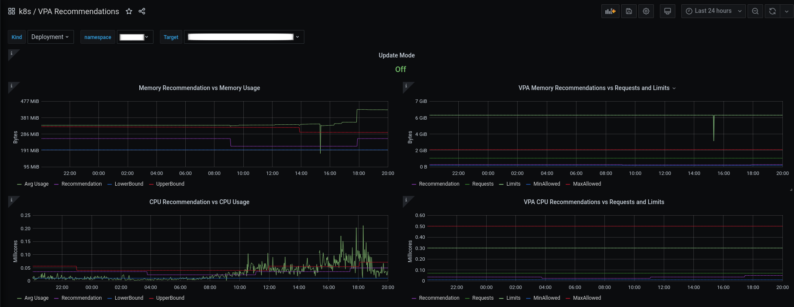
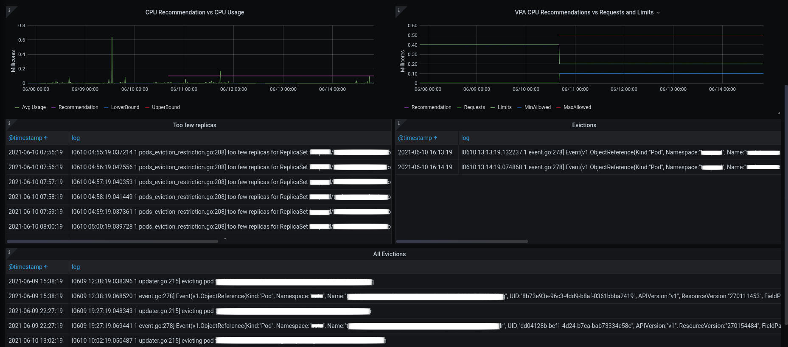

# VPA Grafana Dashboard 

A Grafana dashboard for Kubernetes Vertical Pod Autoscaler.

Uses Prometheus datasource to get VPA metrics (lowerBound, upperBound, target, minAllowed, maxAllowed, update_mode) and average pod resources usage (cpu, memory).

Also uses Elasticsearch datasource to show `Eviction` and `too few replicas` events.

Remember: Enable `verticalpodautoscalers` collector on `kube-state-metrics` (described [here](https://github.com/kubernetes/kube-state-metrics/blob/master/docs/verticalpodautoscaler-metrics.md#Configuration)).

Credits: Based on vpa-dashboard from [gardener](https://github.com/gardener/gardener).

[https://grafana.com/grafana/dashboards/14568](https://grafana.com/grafana/dashboards/14568)